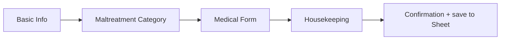
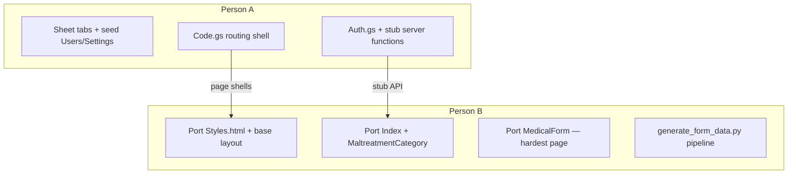

# FAIR Questionnaire — Apps Script Migration Plan

Plan for migrating the FAIR Questionnaire from Flask + SQLite to Google Sheets + Apps Script (per the internal workflow architecture guide), including a two-person work split and parallel execution strategy.

---

## What You Are Migrating

| Today (Flask) | New (Apps Script) |
|---|---|
| SQLite `submissions` table | **Submissions** sheet tab |
| Hardcoded `raters` / `sites` in `app.py` | **Settings** sheet tab (editable by admins) |
| No auth | **Users** sheet tab + Google Workspace login |
| Flask routes (`/`, `/medical-form`, etc.) | `doGet(e)` with `?page=...` |
| `fetch('/confirmation')` POST | `google.script.run.saveSubmission(...)` |
| Jinja templates | HtmlService HTML files |
| `data/*.json` form definitions | `FormData.gs` (already started) |

The rater flow stays conceptually the same:



Client-side `localStorage` for drafts can stay as-is — it maps cleanly to Apps Script.

---

## Recommended Split: Platform/Admin vs Rater Form

This split minimizes merge conflicts and lets both people move quickly after a short shared setup.

### Person A — Platform, Data, and Admin

**Owns:** spreadsheet schema, auth, backend `.gs` files, deployment, admin UI.

| Deliverable | Maps from Flask |
|---|---|
| Google Sheet with tabs: `Users`, `Submissions`, `Settings` | DB + hardcoded lists |
| `Auth.gs` — `getCurrentUser()`, `getUserRole()`, `requireUser()` | New |
| `Code.gs` — `doGet`, `include()` for shared HTML/CSS | Flask routes |
| `Submissions.gs` — save, list, get-by-id | `/confirmation` POST + admin query |
| `Settings.gs` — get/add/edit/delete raters & sites | Admin dashboard backend |
| `AdminDashboard.html` | `admin_dashboard.html` |
| Deploy web app + test org auth | N/A |

**Roles to define upfront:** e.g. `rater` (form access) and `admin` (dashboard + settings).

---

### Person B — Rater-Facing UI and Form Pipeline

**Owns:** HTML/CSS/JS port, multi-step form, dynamic medical form rendering.

| Deliverable | Maps from Flask |
|---|---|
| `Styles.html` + `DashboardStyles.html` | `static/css/style.css`, `dashboard.css` |
| `Scripts.html` — shared helpers (localStorage, navigation) | Inline scripts in templates |
| `Index.html` | `basic_info.html` |
| `MaltreatmentCategory.html` | `maltreatement_category.html` |
| `MedicalForm.html` + client JS | `medical_form.html` (largest file) |
| `Housekeeping.html` | `housekeeping.html` |
| `Confirmation.html` | `confirmation.html` |
| `scripts/generate_form_data.py` | Keeps `data/*.json` → `FormData.gs` in sync |

Person B can start by porting HTML/CSS and keeping the existing `localStorage` flow; wiring to the backend comes once Person A exposes stub functions.

---

## How to Run Work in Parallel

### Phase 0 — Together (half day, blocking)

Do this before either person goes deep. Nothing else parallelizes well without it.

1. **Agree on the server API** (function names + return shapes):

   ```
   getCurrentUser()           → { email, role, name }
   getRaters()                → string[]
   getSites()                 → string[]
   getMaltreatmentTypes()     → { label, id }[]   // already in FormData.gs
   getFormDefinition(typeId)  → object            // already in FormData.gs
   saveSubmission(payload)    → { status: 'ok', id }
   getSubmissions()           → summary rows for admin table
   addRater / updateRater / deleteRater  (admin only)
   addSite  / updateSite  / deleteSite   (admin only)
   ```

2. **Agree on submission JSON shape**

   ```json
{
  "submitted_at": "",
  "name": "",
  "rater1": "",
  "rater2": "",
  "date": "",
  "site": "",
  "case_number": "",
  "maltreatment_type": "",
  "hard_case": "",
  "why_hard_case": "",
  "why_hard_case_other": "",
  "medical_provider": "",
  "responses": {}
}
   ```

3. **Agree on page routing:**

   | Page | URL param | Who |
   |---|---|---|
   | Basic info | `?page=Index` (default) | B |
   | Maltreatment | `?page=MaltreatmentCategory` | B |
   | Medical form | `?page=MedicalForm&type=child-physical` | B |
   | Housekeeping | `?page=Housekeeping` | B |
   | Confirmation | `?page=Confirmation` | B |
   | Admin | `?page=AdminDashboard` | A |
   | Unauthorized | `?page=Unauthorized` | A |

4. **Create the Sheet** and share it only with admins; raters use the web app URL only.

5. **Git convention:** both work under `apps-script/`; A owns `*.gs` except `FormData.gs`, B owns `*.html` + `scripts/generate_form_data.py`.

---

### Phase 1 — Parallel (days 1–3)



**Person A** ships **stub functions** that return realistic mock data so B can test UI in the deployed web app without waiting for real sheet writes.

**Person B** ports pages using `google.script.run` against those stubs. The medical form is the heaviest lift (criteria, voting tables, footnotes, conditional fields) — budget most of B's time there.

**No dependency between:** admin dashboard UI (A) and form pages (B).

---

### Phase 2 — Parallel (days 4–5)

| Person A | Person B |
|---|---|
| Real `Submissions.gs` writes to Sheet | Wire `Housekeeping` → `saveSubmission` |
| Real `Settings.gs` CRUD | Wire dropdowns to `getRaters()` / `getSites()` |
| Finish `AdminDashboard` (submissions table + settings drawer) | Finish `Confirmation` + clear localStorage on success |
| Role gate: admin page requires `admin` role | End-to-end rater flow test |

**Integration checkpoint:** one complete submission lands in the Sheet and appears in the admin table.

---

### Phase 3 — Together (final day)

- Auth testing with authorized vs unauthorized NYU accounts
- Deploy new version (`Deploy → Manage deployments → New version`)
- Optional: one-time export of existing SQLite rows into the Submissions sheet
- Retire or archive the Flask app

---

## Alternative Split (if skills differ)

If one person is stronger on UI and one on data/backend, swap labels but keep the same boundaries:

- **UI person:** all `.html`, CSS, client JS, medical form rendering
- **Data person:** Sheet design, all `.gs`, deployment, admin CRUD

Avoid splitting by *page* (e.g. "you do basic info, I do medical form") — both pages share `Styles.html`, `Scripts.html`, and navigation patterns, which creates constant merge conflicts.

---

## Git Workflow for Two People

```
main
 ├── feature/platform-auth-submissions   (Person A)
 └── feature/rater-form-ui               (Person B)
```

- Merge **platform branch first** (auth + stubs + `Code.gs` routing).
- B rebases onto that, then merges form UI.
- Touch different files by default: A = `Auth.gs`, `Submissions.gs`, `Settings.gs`, `Code.gs`; B = `*.html`, `FormData.gs`, `generate_form_data.py`.
- Only `Code.gs` needs coordination when adding new pages — add a one-line note in a shared doc or PR comment when registering a new `?page=`.

---

## Decisions to Make in Phase 0

1. **Data sensitivity** — The architecture guide warns this stack is not for highly regulated data. FAIR case content is sensitive; confirm with your team that an org-restricted Apps Script web app + private Sheet is acceptable vs. keeping Flask on managed infrastructure.

2. **Admin dashboard scope for v1** — Current Flask admin UI shows sites/raters lists and a submissions table, but edit/delete looks partially stubbed. Decide: ship read-only admin first, or full CRUD before launch.

3. **Settings source of truth** — Move raters/sites fully into the Sheet (recommended) vs. keeping hardcoded lists in `FormData.gs`.

4. **Form data workflow** — Keep editing `data/*.json` locally and regenerating `FormData.gs` via Python (good for version control), or edit forms only in-repo.

5. **Who owns the Google Sheet / deployment** — One person should hold owner access and manage deployments to avoid conflicting deploy URLs.

---

## Rough Effort Estimate

| Area | Owner | Relative size |
|---|---|---|
| Auth + routing + deployment | A | Medium |
| Submissions + Settings backend | A | Medium |
| Admin dashboard | A | Medium |
| CSS/base layout port | B | Small |
| Basic info + category + housekeeping | B | Small |
| Medical form (dynamic, 8 types) | B | **Large** |
| `generate_form_data.py` | B | Small |
| Integration + testing | Both | Medium |

---

## Suggested First Actions

1. **30-min kickoff:** walk through Phase 0 checklist and assign A/B.
2. **Person A:** create the Sheet, seed `Users` with both of your emails, draft the API list in a shared doc.
3. **Person B:** inventory `medical_form.html` complexity (voting tables, footnotes, conditionals) and confirm `FormData.gs` covers all 8 types.
4. **Both:** agree on v1 scope (admin CRUD yes/no, SQLite migration yes/no).
